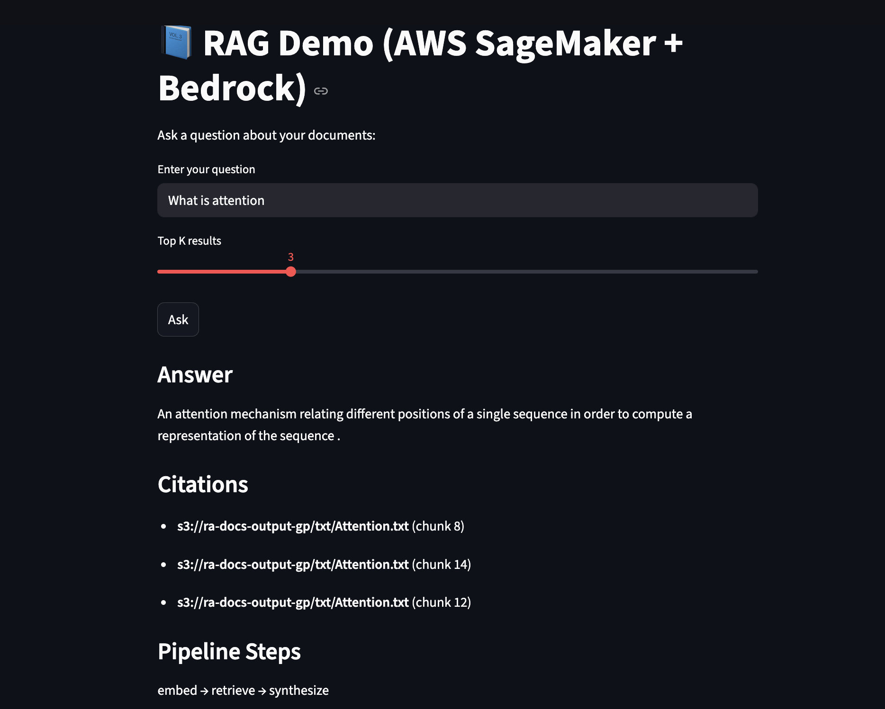

# TitanRAG

## Serverless Retrieval-Augmented Generation System on AWS

TitanRAG is an end-to-end Retrieval-Augmented Generation (RAG) system built on AWS. It ingests PDF documents, extracts and chunks text, generates vector embeddings with Amazon Titan, stores embeddings in Aurora PostgreSQL with pgvector, retrieves relevant context through semantic search, and generates grounded answers through an LLM-backed API.

The project demonstrates applied AI engineering across document ingestion, vector search, cloud-native serverless architecture, API serving, and user-facing question answering.

---

## Project Highlights

- End-to-end RAG pipeline for PDF-based question answering.
- Serverless ingestion using Amazon S3 and AWS Lambda.
- Dense vector search with Aurora PostgreSQL and pgvector.
- Embedding generation using Amazon Titan Embeddings.
- API layer built with Amazon API Gateway and AWS Lambda.
- Streamlit interface for interactive document Q&A.
- Security, evaluation, and deployment considerations documented.

---

## Problem

Organizations often store important knowledge in PDFs, manuals, reports, policy documents, and internal files. Traditional keyword search struggles when users ask natural-language questions because the exact wording in the document may differ from the user query.

A RAG system solves this by combining semantic retrieval with language generation. Instead of asking an LLM to answer from memory, the system first retrieves relevant document chunks and uses them as context for answer generation.

TitanRAG was built to demonstrate how this workflow can be implemented using AWS managed services.

---

## Solution

TitanRAG uses a modular serverless architecture to support document ingestion and semantic question answering.

The system performs four main functions:

1. Ingest PDF documents from Amazon S3.
2. Extract, clean, chunk, and embed document text.
3. Store chunks and embeddings in Aurora PostgreSQL with pgvector.
4. Retrieve relevant context and generate answers through an API and Streamlit interface.

This design separates ingestion, retrieval, generation, and UI layers, making the system easier to extend, evaluate, and deploy.

---

## Architecture


### High-Level Flow

```text
PDF Upload
   |
   v
Amazon S3
   |
   v
S3 Event Trigger
   |
   v
AWS Lambda
   |
   v
Text Extraction + Chunking
   |
   v
Amazon Titan Embeddings
   |
   v
Aurora PostgreSQL + pgvector
   |
   v
User Query
   |
   v
Query Embedding
   |
   v
Vector Search
   |
   v
Retrieved Context
   |
   v
LLM Response Generation
   |
   v
API Gateway + Lambda
   |
   v
Streamlit UI
```

---

## System Workflow

| Step | Stage | Description |
| --- | --- | --- |
| 1 | Document Ingestion | PDF files are uploaded to Amazon S3. An S3 event triggers a Lambda function that starts the ingestion workflow. |
| 2 | Text Extraction | The Lambda function extracts text from the uploaded PDF and prepares it for downstream processing. |
| 3 | Chunking | Extracted text is split into smaller chunks so each passage can be embedded and retrieved independently. |
| 4 | Embedding Generation | Each chunk is converted into a vector embedding using Amazon Titan Embeddings. |
| 5 | Vector Storage | Chunk text, metadata, and embedding vectors are stored in Aurora PostgreSQL using pgvector. |
| 6 | Semantic Retrieval | User questions are embedded and compared against stored document vectors using semantic similarity. |
| 7 | Answer Generation | Relevant chunks are assembled into context and passed to an LLM for grounded answer generation. |
| 8 | User Interface | A Streamlit app provides a simple interface for asking questions and viewing generated answers. |

---

## My Technical Contribution

I independently designed and implemented TitanRAG as a cloud-native applied AI system.

My work included:

- Designing the end-to-end RAG architecture.
- Building the document ingestion flow using S3 and Lambda.
- Implementing text extraction and chunking logic.
- Integrating Amazon Titan embeddings.
- Designing vector storage using Aurora PostgreSQL and pgvector.
- Implementing retrieval logic for semantic search.
- Building the API layer using Lambda and API Gateway.
- Creating a Streamlit UI for document-based question answering.
- Documenting security, evaluation, and deployment considerations.

The project reflects my focus on building AI systems that are modular, explainable, and closer to production workflows than simple LLM demos.

---

## Tech Stack

| Layer | Technology |
| --- | --- |
| Document Storage | Amazon S3 |
| Event Processing | AWS Lambda |
| Embeddings | Amazon Titan Embeddings |
| Vector Database | Aurora PostgreSQL with pgvector |
| Retrieval | Vector similarity search |
| Generation | Amazon Bedrock / SageMaker-hosted model |
| API Layer | Amazon API Gateway + AWS Lambda |
| UI | Streamlit |
| Language | Python |

---

## Repository Structure

```text
TitanRAG/
|-- README.md
|-- requirements.txt
|-- .env.example
|-- architecture.png
|-- app/
|   `-- streamlit_app.py
|-- lambdas/
|   |-- text_extract.py
|   |-- ingest_embed.py
|   `-- rag_api.py
|-- db/
|   `-- schema.sql
|-- docs/
|   |-- architecture.md
|   |-- evaluation.md
|   `-- security.md
`-- screenshots/
    `-- result.png
```

---

## Retrieval Strategy

TitanRAG uses dense vector retrieval instead of simple keyword search.

The retrieval process is:

1. Convert the user question into an embedding.
2. Compare the query embedding against stored document chunk embeddings.
3. Retrieve the most semantically relevant chunks.
4. Pass only the retrieved context to the generation model.

This improves answer grounding because the LLM receives document-specific context instead of relying only on its pretrained knowledge.

---

## Database Schema

The vector table is defined in `db/schema.sql`.

```sql
CREATE EXTENSION IF NOT EXISTS vector;

CREATE TABLE IF NOT EXISTS rag_chunks (
    id BIGSERIAL PRIMARY KEY,
    source_file TEXT NOT NULL,
    chunk_index INTEGER NOT NULL,
    chunk_text TEXT NOT NULL,
    embedding VECTOR(1024),
    created_at TIMESTAMP DEFAULT CURRENT_TIMESTAMP
);

CREATE INDEX IF NOT EXISTS rag_chunks_embedding_hnsw_idx
ON rag_chunks
USING hnsw (embedding vector_cosine_ops);
```

The schema supports source tracking, chunk-level retrieval, vector search, and future improvements such as citation display and document-level filtering.

---

## Evaluation and Limitations

TitanRAG is designed around retrieval quality and grounded generation.

The system can be evaluated across three levels:

| Area | Goal |
| --- | --- |
| Retrieval Relevance | Check whether retrieved chunks contain information relevant to the user question. |
| Grounded Answer Quality | Check whether the generated answer is supported by the retrieved context. |
| Failure Handling | Identify queries where the retrieved context is weak, missing, or unrelated. |

Current limitations:

- The current version focuses on the core RAG workflow rather than advanced reranking.
- The system does not yet include confidence thresholds for low-relevance retrieval.
- The UI can be extended to show retrieved source chunks and citations.
- Future versions can add reranking, LLM-as-judge evaluation, and document-level access control.

---

## Security Considerations

TitanRAG avoids committing credentials or private infrastructure details to source control.

Security practices include:

- Using `.env.example` as a configuration template.
- Keeping AWS credentials out of the repository.
- Reading deployment-specific values from environment variables or Streamlit secrets.
- Designing the architecture to support least-privilege IAM roles.
- Keeping API endpoints configurable instead of hard-coded.

Future security improvements:

- Add Cognito or IAM authorization for API Gateway.
- Add request-level logging and rate limiting.
- Add document-level access control.
- Add encryption checks for S3 and Aurora PostgreSQL.

---

## Setup

Install dependencies:

```bash
pip install -r requirements.txt
```

Create environment variables based on `.env.example`:

```bash
cp .env.example .env
```

Example configuration:

```env
AWS_REGION=us-east-1
S3_BUCKET_NAME=your-s3-bucket-name
AURORA_HOST=your-aurora-cluster-endpoint
AURORA_PORT=5432
AURORA_DATABASE=your-database-name
AURORA_USER=your-db-user
AURORA_PASSWORD=your-db-password
BEDROCK_EMBEDDING_MODEL_ID=amazon.titan-embed-text-v2:0
BEDROCK_TEXT_MODEL_ID=amazon.titan-text-express-v1
API_URL=https://your-api-gateway-url.execute-api.region.amazonaws.com/prod/query
```

Run the Streamlit app:

```bash
streamlit run app/streamlit_app.py
```

---

## Demo

The demo shows a user asking a question through the Streamlit interface and receiving a generated answer from the RAG pipeline.



---

## Future Improvements

Planned improvements include:

- Add retrieved chunk display in the UI.
- Add source citations for generated answers.
- Add reranking before generation.
- Add confidence thresholds for low-relevance queries.
- Add LLM-as-judge evaluation for groundedness.
- Add authentication for API access.
- Add document-level filtering and access control.
- Add automated tests for ingestion and retrieval logic.

---

## Why This Project Matters

TitanRAG demonstrates my ability to design and build applied AI infrastructure using modern cloud-native components. It combines retrieval engineering, vector databases, LLM orchestration, serverless APIs, and user-facing product design.

The project is relevant to production AI use cases where organizations need reliable document intelligence systems that are grounded in private knowledge sources.
